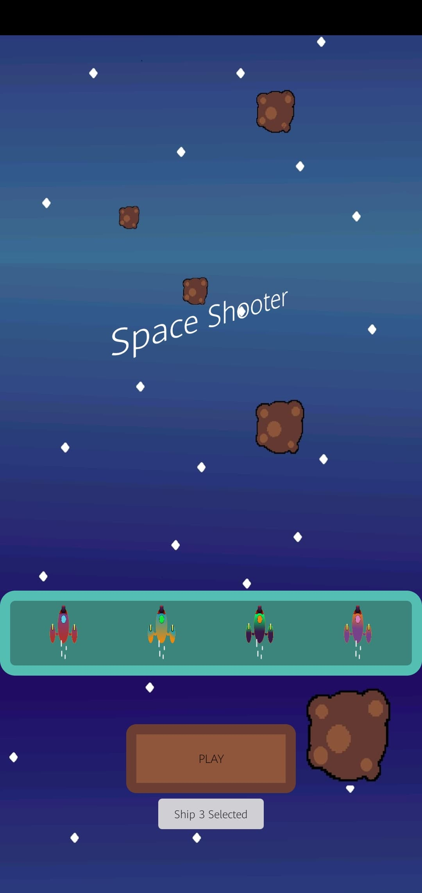
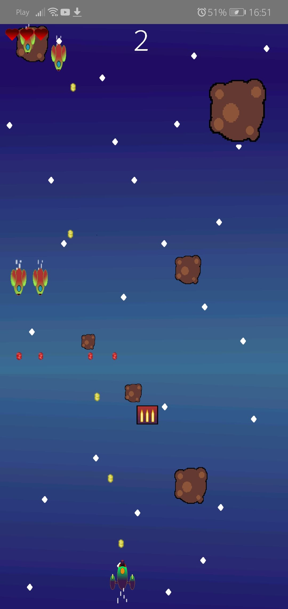

# 🚀 SpaceShooter
A simple game in which you shoot at an alien civilization.

This project is a recreation of an old retro game

  
## 🕹️ Instalation and How to Play
Export project from Zip and Import full folder

You move your ship by clicking screen 30% from bottom. 70% of screen is shooting option. 
If You click on left side in those 30% you will move left. Same thing with right side

  

## 💻 Progress

██████████  100%

 
  
## 🗺️ What's new 

* Sound Effects
* Enemy shoot bullets 
* Better background
* Starship 4 theme.
* 8 types of Bonuses
* Add lives (up to 5)
* Displaying live score and lives.
* Fix colisions.
* Fix major bug
* Result activity
* Apk release

  
## 📷 Screenshots

   
    
   
      
    

